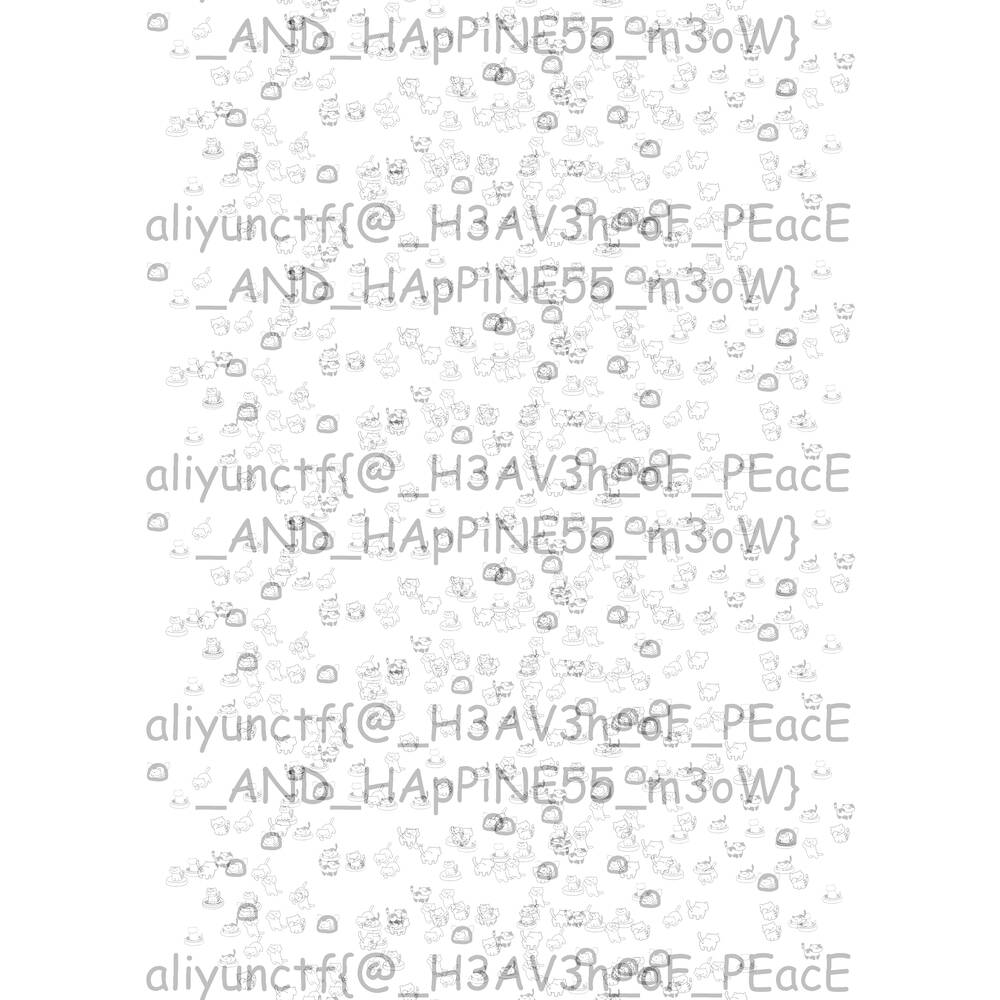
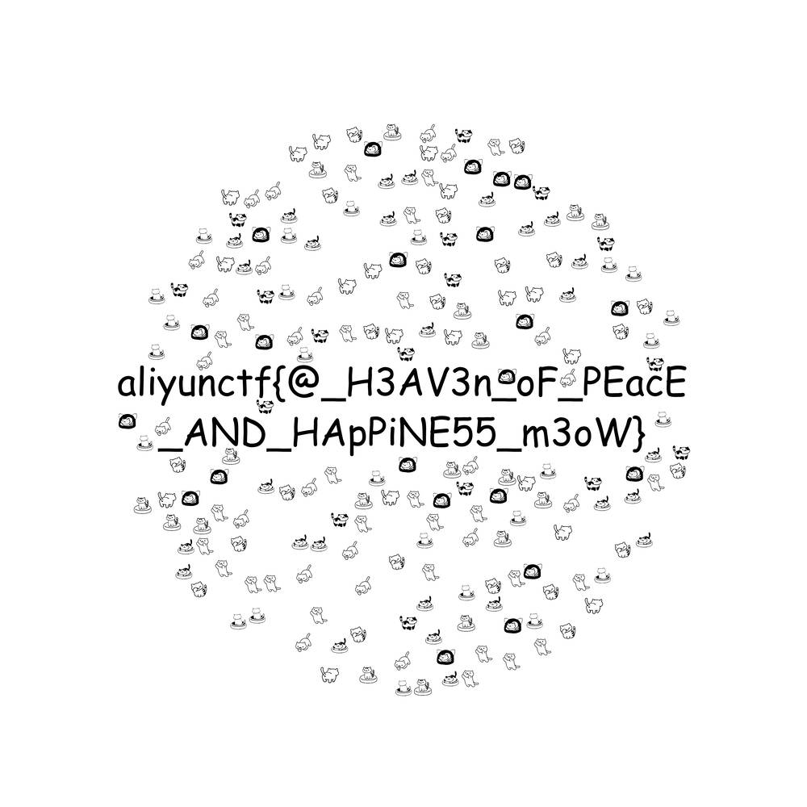

# NanoCatPlanetSolution
Solution to the NanoCatPlanet challenge from Aliyun CTF 2023

`cargo run --release -- gui`

This tool was how I solved this challenge, in the GUI, go along increasing offset_x until you get to all lines vertical - offset_x = 5809.
Then increase offset_y until you get the watermark - offset_y = 26.

You can then use the CLI to recover the flag.
`cargo run --release -- cli --orig-img planet_orig.png --watermarked-img planet_fixed.png --output-img flag.png --dx 5809 --dy 26`

Later on in a VC with some friends we found another solution at 5809,601 and worked out the of the function is 575, with this we found 5809,2901 which we believe to be the original watermark image.
`cargo run --release -- cli --orig-img planet_orig.png --watermarked-img planet_fixed.png --output-img flag.png --dx 5809 --dy 2901`

